# h7 - Maalisuora

Tämä raportti on osa Tero Karvisen Linux palvelimet -kurssia. Tehtävänanto löytyy sivustolta https://terokarvinen.com/linux-palvelimet/

## Tehtävä a - kirjoita ja aja "Hei maailma" kolmella kielellä

### bash

Hello World bash-skriptauskielenä:

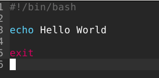

Oikeudet kaikille ajaa ohjelma.   

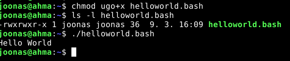

Toimii.

### python

Tarkistin että python3 on asennettu

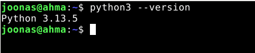

Jos ei olisi asennettuna ajaisin komennot

    sudo apt update
    sudo apt install python3

Hello world pythonilla

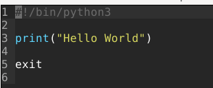

Oikeudet ajaa ohjelma

    chmod ugo+x helloworld.py

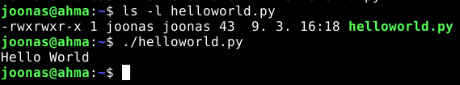

### C

Tarkistin että gcc compiler ohjelma on asennettu.

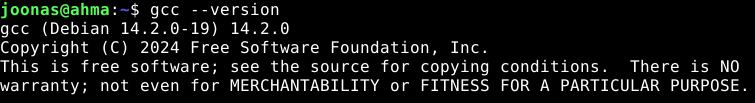

Kirjoitin Hello World:

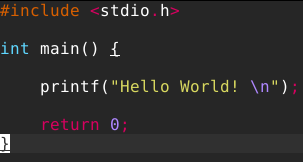

Compile käyttämällä gcc. Loi uuden a.out tiedoston, jonka ajamalla saa ohjelman ajettua.

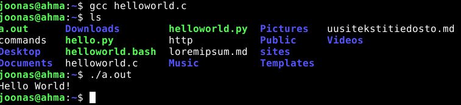

Lähde: https://www.geeksforgeeks.org/cpp/how-to-compile-and-run-a-c-c-code-in-linux/

## Tehtävä c - uusi komento

Loin komennon, joka tarkistaa ja asentaa saatavilla olevat päivitykset:

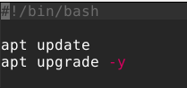

Kaikille oikeudet ajaa komentoa:

    chmod ugo+x paketit

Siirretään komento kansioon, josta kaikki voivat ajaa komennon.

    mv paketit /usr/local/bin/

Testataan että toimii

    sudo paketit

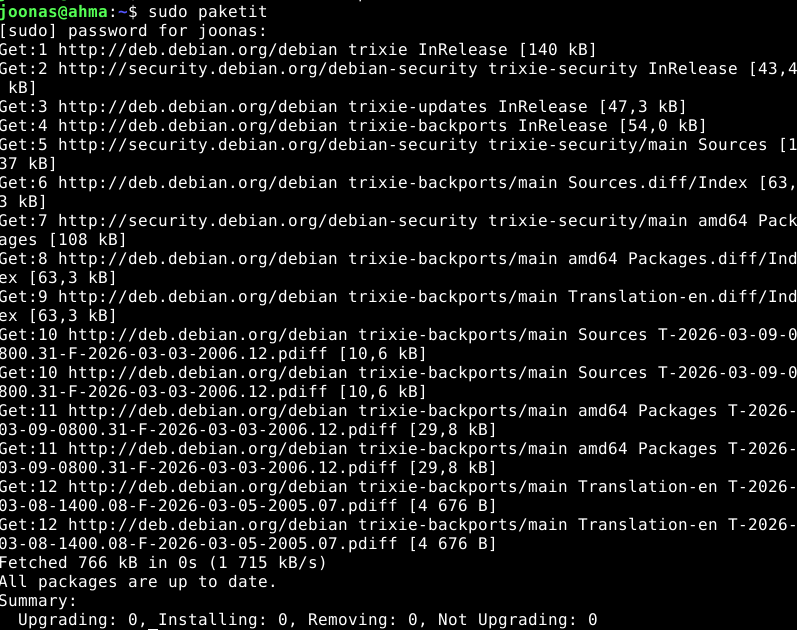

Lähde: https://askubuntu.com/questions/308045/differences-between-bin-sbin-usr-bin-usr-sbin-usr-local-bin-usr-local

## Tehtävä d - Vanha labraharjoitus (Kesken)

9.3.2026 17:00

Päätin tehdä laboratorioharjoituksen vuodelta 2024.

Linkki laboratorioharjoitukseen:

https://terokarvinen.com/2024/arvioitava-laboratorioharjoitus-2024-linux-palvelimet/

Tehtävä kuuluisi tehdä tyhjällä virtuaalikoneella, mutta virtuaalikoneen uudelleen asentamisessa menee sen verran aikaa, että on järkevämpää asentaa esim. apache vain uudelleen. 

Tarkoitus tehdä harjoituksessa tehtävät d:stä h:n alkuosaan

### d - 'howdy'

Loin uuden komennon micro-editorilla:

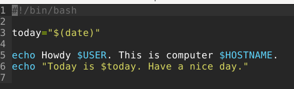

Annoin komennolle execute oikeudet ja siirsin sen sudo mv komennolla /usr/local/bin kansioon.

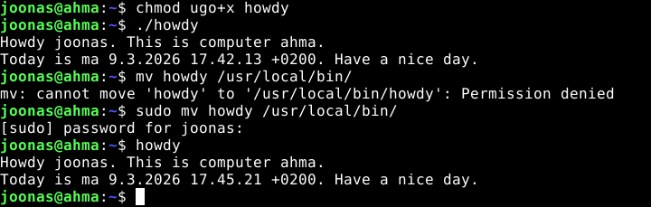

Lähdeaineisto, kun halusin käyttää komennon tulosta muuttujassa: https://www.cyberciti.biz/faq/unix-linux-bsd-appleosx-bash-assign-variable-command-output/

### e - Etusivu uusiksi

9.3.2026 17:55

Asensin uudelleen Apache2:n

    sudo apt purge apache2
    sudo apt install apache2

Otin default sivun pois käytöstä: 

    sudo a2dissite 000-default

Uusi html-sivu omaan kotihakemistoon:

    cd /home/joonas/sites
    mkdir ai-kakone
    cd ai-kakone
    micro index.html

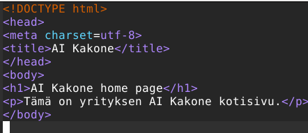

Tarkistin oikeudet

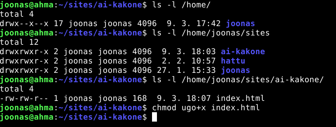

Tein name based virtual host config tiedoston.

    cd /etc/apache2/sites-available
    sudo micro ai-kakone.conf

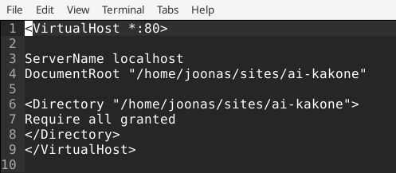

Lähteet conf tiedoston tekemiseen:

https://httpd.apache.org/docs/2.4/vhosts/name-based.html

https://superuser.com/questions/1015922/how-to-configure-name-based-virtual-hosts-on-apache-2-4-in-linux

    sudo a2ensite ai-kakone.conf
    sudo systemctl restart apache2

Tämän jälkeen http://localhost näyttää tältä:

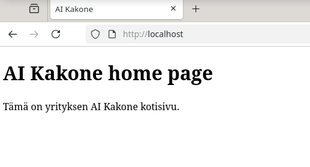

### g - salattua hallintaa

9.3.2026 18:50

Host koneelta ei ollut verkkoyhteyttä virtuaalikoneeseen. 

ip address -komento antoi osoitteen 10.0.2.15 jota koitin pingata host-koneellani epäonnistuneesti.

Miten kuitenkin tekisin tämän tehtävän on seuraavanlaisesti:

1. Asenna openssh-serveri

2. Tee ulkopuolisella koneella ssh avain ssh-keygen komennolla

3. Kopioi julkinen avain virtuaalikoneelle ja siitä home/joonas/.ssh/authorized_keys tiedostoon 

4. Kävisin läpi /etc/ssh/sshd_config tiedoston, jotta avaimen kanssa kirjautuminen sallitaan ja salasanan kanssa kirjautuminen otetaan pois käytöstä. 

